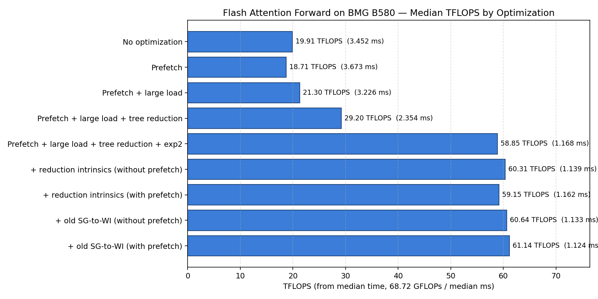

# Flash Attention Performance study on BMG B580

**Workload:** Flash attention forward pass with 4K sequence length.

### Machine-specific information:
-----------------------------
**Machine:** `BMG B580`

**EU count:** `320`

**L3 cache size:** `18874368 Byte (18 MB)`

### Workload-specific information:
-----------------------------
**Input range:** Random number between `-1.0` and `1.0`

**Sequence length (N_CTX):** `4096`

**D_HEAD:** `64`

**ZxH:** `16`

**Per-WG data:** `128x64`

Here we show the performance of Flash Attention FWD pass. We applied different optimizations to get to the peak TFLOPS (~65 TFLOPS).

## Summary (sorted by peak TFLOPS)

| Configuration                                 |    Min (ms) | Max TFLOPS | Max (ms) | Min TFLOPS | Median (ms) | Med TFLOPS | Speedup vs. baseline (peak) |
| --------------------------------------------- | ----------: | ---------: | -------: | ---------: | ----------: | ---------: | --------------------------: |
| No optimization                               |     3.38499 |      20.30 |  3.53527 |      19.44 |     3.45207 |      19.91 |                       1.00x |
| Prefetch                                      |     3.59164 |      19.13 |  3.74275 |      18.36 |     3.67276 |      18.71 |                       0.94x |
| Prefetch + large load                         |     3.21131 |      21.40 |  3.25822 |      21.09 |     3.22556 |      21.30 |                       1.05x |
| Prefetch + large load + tree reduction        |     2.34510 |      29.30 |  2.40729 |      28.55 |     2.35352 |      29.20 |                       1.44x |
| Prefetch + large load + tree reduction + exp2 |     1.09959 |      62.50 |  1.21368 |      56.62 |     1.16766 |      58.85 |                       3.08x |
| + reduction intrinsics (without prefetch)     |     1.08566 |      63.30 |  1.18102 |      58.19 |     1.13948 |      60.31 |                       3.12x |
| + reduction intrinsics (with prefetch)        |     1.09845 |      62.56 |  1.21503 |      56.56 |     1.16178 |      59.15 |                       3.08x |
| + old SG-to-WI (without prefetch)             |     1.08046 |      63.60 |  1.18321 |      58.08 |     1.13318 |      60.64 |                       3.13x |
| + old SG-to-WI (with prefetch)                | **1.05778** |  **64.97** |  1.17510 |      58.48 |     1.12393 |      61.14 |                   **3.20x** |

<!-- ## Per-configuration detail

| Configuration                                 |     Min |     Max |     Avg |  Median | StdDev | TFLOPS (peak) |
| --------------------------------------------- | ------: | ------: | ------: | ------: | -----: | ------------: |
| No optimization                               | 3.38499 | 3.53527 | 3.45283 | 3.45207 | 0.0361 |         20.30 |
| Prefetch                                      | 3.59164 | 3.74275 | 3.66870 | 3.67276 | 0.0291 |         19.13 |
| Prefetch + large load                         | 3.21131 | 3.25822 | 3.22754 | 3.22556 | 0.0091 |         21.40 |
| Prefetch + large load + tree reduction        | 2.34510 | 2.40729 | 2.35847 | 2.35352 | 0.0133 |         29.30 |
| Prefetch + large load + tree reduction + exp2 | 1.09959 | 1.21368 | 1.16540 | 1.16766 | 0.0279 |         62.50 |
| + reduction intrinsics (without prefetch)     | 1.08566 | 1.18102 | 1.13857 | 1.13948 | 0.0214 |         63.30 |
| + reduction intrinsics (with prefetch)        | 1.09845 | 1.21503 | 1.16122 | 1.16178 | 0.0286 |         62.56 |
| + old SG-to-WI (without prefetch)             | 1.08046 | 1.18321 | 1.13193 | 1.13318 | 0.0213 |         63.60 |
| + old SG-to-WI (with prefetch)                | 1.05778 | 1.17510 | 1.12170 | 1.12393 | 0.0286 |     **64.97** | --> |

## Median TFLOPS comparison

## Optimization details

Each optimization below is layered on top of the previous row in the summary table; the `+` rows inherit every preceding stage.

- **Prefetch** — `xegpu.prefetch_nd` issued one `K`/`V` tile ahead of the matching `load_nd` with `l1/l2/l3 = cached` hints. Warms the cache for the next `scf.for` iteration so the consumer load hits in L1/L2 instead of waiting on DRAM. On its own it adds address-generation overhead and can evict reused tiles, which is why this row is slower than the no-opt baseline.
- **Large load** — widens `xegpu.load_nd` by using `array_length > 1` on the tensor descriptor so the same message fetches multiple adjacent 2-D blocks in one transaction. Cuts the number of load messages and header instructions per byte, making prefetch and load profitable.
- **Tree reduction** — lowers the softmax `max` and `sum` reductions from a linear shuffle chain (O(SG) serial dependency) to a log-depth tree using `xegpu.reduce` / subgroup shuffles. Shortens the critical path inside the flash-attention inner loop, which is reduction-heavy.
- **`exp2`** — rewrites the softmax `math.exp(x)` as `math.exp2(x · log2(e))` and folds the `log2(e) = 1.4427` factor into the pre-softmax scale constant (so `sm_scale_gpu = sm_scale · log2(e)`). Xe cores have a native `exp2` op; `exp` expands to a polynomial fall-back. This step alone roughly doubles end-to-end TFLOPS because `exp` sits on the critical path and is evaluated once per `(row, col)` of the attention matrix. We enable `exp2` by enabling `fastmath` on `math.exp`, which in turn gets converted to `math.exp2` multiplied by the factor by the `math-to-xevm pass`.
- **Reduction intrinsics** — lowers `vector.multi_reduction` onto dedicated subgroup reduction intrinsics instead of a software shuffle tree. Replaces multiple `xegpu.reduce` + shuffle sequences with a single hardware reduction, shaving ~1% and mostly improving consistency (tighter stddev).
- **Old SG-to-WI pass** — opts out of the new upstream subgroup-to-work-item distribution and uses the legacy path. For this kernel the old pass produces better register allocation / fewer spills, recovering another ~4% at peak and giving the fastest absolute run (1.058 ms).
- **"With prefetch" vs. "without prefetch" (final rows)** — toggles `xegpu.prefetch_nd` on top of the fully-optimized pipeline (tree reduction + exp2 + intrinsics + old SG-to-WI are always on). Once the load path is already saturated by wide loads and the reduction path by intrinsics, prefetch no longer helps and sometimes mildly hurts by adding address-gen work.

## Key observations

- **Prefetch alone hurts** (19.13 vs. 20.30 TFLOPS). It only pays off when paired with wider loads or tree reduction.
- **Tree reduction** is the first meaningful jump: 21.40 -> 29.30 TFLOPS (~1.37x on top of prefetch + large-load).
- **`exp2` is the single biggest win**: 29.30 -> 62.50 TFLOPS (~2.13x step-up). Using base-2 exp eliminates the `log(e)` scaling and maps directly to hardware `exp2` instructions.
- **Reduction intrinsics** add a small gain (~1%). Marginal on top of `exp2`.
  - "with prefetch" / "without prefetch" refers to whether prefetch is enabled on top of the named optimization; all other stages (tree reduction, exp2, etc.) remain enabled.
- **Old SG-to-WI pass** gives another ~4% at peak and lands the fastest absolute result (1.058 ms).
- **Prefetch is neutral-to-slightly-hurtful once fully optimized.** In the final stages, disabling prefetch changes peak TFLOPS by <2% and sometimes lowers stddev (more consistent runs).
- **Peak measured: 64.97 TFLOPS** on BMG B580.
